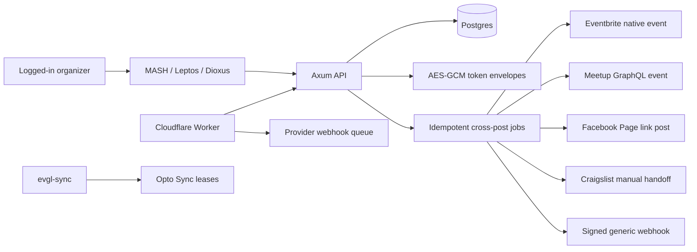

# Architecture

```mermaid
flowchart LR
  User[Logged-in organizer] --> Web[MASH / Leptos / Dioxus]
  Web --> API[Axum API]
  API --> DB[(Postgres)]
  API --> Vault[AES-GCM token envelopes]
  API --> Jobs[Idempotent cross-post jobs]
  Jobs --> EB[Eventbrite native event]
  Jobs --> MU[Meetup GraphQL event]
  Jobs --> FB[Facebook Page link post]
  Jobs --> CL[Craigslist manual handoff]
  Jobs --> WH[Signed generic webhook]
  Edge[Cloudflare Worker] --> API
  Edge --> Queue[Provider webhook queue]
  Sync[evgl-sync] --> Opto[Opto Sync leases]
```

The canonical event remains independent of provider-specific publications.
A provider receipt can be retried or reconciled without mutating the source event.
